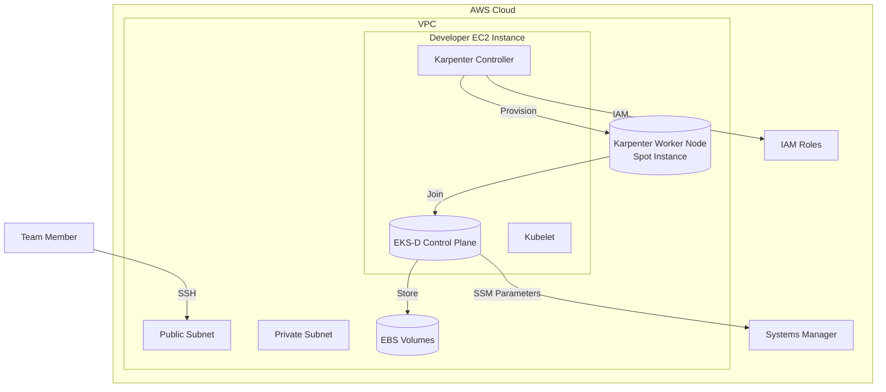
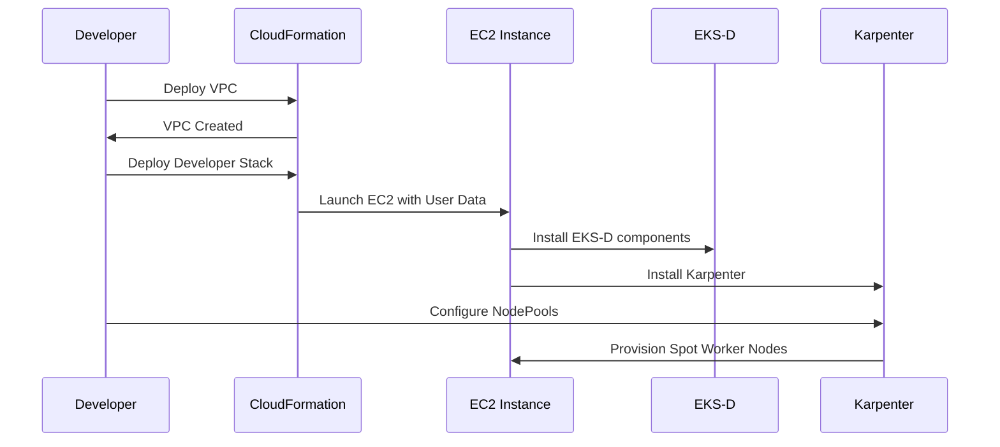

# Architecture

## System Architecture

## Component Overview

| Component | Description | Location |
|-----------|-------------|----------|
| **EKS-D Control Plane** | Self-managed Kubernetes control plane (API server, etcd, controller, scheduler) | `eks-d-setup/06-install-eks-d.sh` |
| **Karpenter** | Worker node auto-provisioner | `karpenter-config/`, `eks-d-setup/11-install-karpenter.sh` |
| **VPC** | Shared VPC with public/private subnets | `infrastructure/shared-vpc-template.yaml` |
| **Developer Stack** | Per-team-member EC2 with EKS-D | `infrastructure/deploy-developer.sh` |
| **NodePools** | Karpenter node pool definitions | `node-pools/` |

## Deployment Flow

## Network Architecture

- **Public Subnet**: NAT Gateway, Bastion (optional)
- **Private Subnet**: EKS-D control plane, worker nodes
- **Security Groups**: Control plane SG, Worker node SG

## Data Flow

1. Developer deploys VPC → CloudFormation
2. Developer deploys EC2 stack → CloudFormation provisions EC2
3. EC2 user data runs `eks-d-setup/install-all.sh`
4. EKS-D control plane starts on EC2
5. Karpenter installed and configured
6. NodePool created → Karpenter provisions Spot instances
7. Worker nodes join cluster via kubelet
