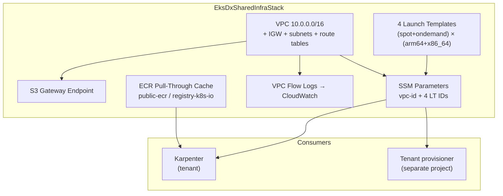
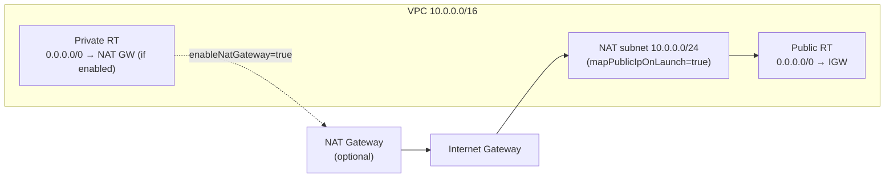

# Architecture

## Overview

A single CDK stack (`EksDxSharedInfraStack`) that provisions all shared AWS resources consumed by EKS-DX tenant control planes. Tenants read VPC and launch template IDs from SSM; they do not interact with this repo directly.

## Design Principles

- **L1 constructs only where no L2 exists** — ECR pull-through cache rules use `CfnPullThroughCacheRule` directly; all other resources use CDK L2/L3 where available.
- **No AMI in launch templates** — AMI is passed as a `RunInstances` override by the tenant provisioner, decoupling AMI updates from shared infra deployments.
- **NAT optional** — S3 gateway endpoint covers the primary egress cost driver (ECR image pulls). NAT Gateway is disabled by default and opt-in via `enableNatGateway` context.
- **SSM as contract** — all consumer-facing outputs are SSM parameters, not CloudFormation exports, so tenants can read them without cross-stack dependencies.
- **All resources tagged** with `Project`, `Platform: eks-d-xpress`, and `ManagedBy: CDK|Karpenter`.

## Network Layout

No private subnets are created by the stack — tenant subnets are provisioned by the tenant provisioner using this VPC ID.
