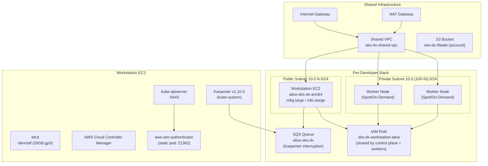
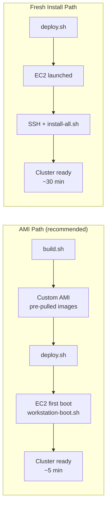

# Architecture

## Overview

EKS-D-Xpress (EKS-DX) provisions isolated developer Kubernetes environments, part of the Express Compute (ECP) product suite. Each developer gets a dedicated EC2 instance running EKS-D as a single-node control plane, with Karpenter provisioning Spot/On-Demand worker nodes on demand.

## Two Deployment Paths

## Networking

- **Shared VPC**: One per region, shared across all developers
- **Per-developer subnets**: Public (`10.0.N.0/24`) + Private (`10.0.(100+N).0/24`), auto-indexed
- **Workstation**: Deployed in public subnet (SSH access, Kubernetes API on :6443)
- **Worker nodes**: Deployed in private subnet (tagged `SubnetType=Private`, `Developer=<signum>`)
- **Pod networking**: AWS VPC CNI — pods get VPC IPs from secondary ENIs
- **ec2-net-utils**: Disabled on AL2023 before VPC CNI install (conflicts with pod routing)

## IAM Design

The control plane EC2 and all Karpenter-provisioned worker nodes share a single IAM role (`eks-dx-workstation-<username>`). This role carries:
- Managed policies: SSM, ECR pull, EKS CNI, EBS CSI, CloudWatch
- Inline policy `eks-dx-karpenter`: EC2/SQS permissions for Karpenter (tag-scoped)
- Inline policy `eks-dx-cloud-provider`: EC2/ELB permissions for AWS CCM (tag-scoped)

Worker node authentication uses `aws-iam-authenticator` (static pod), which maps the shared IAM role to `system:node:{{EC2PrivateDNSName}}` in `system:nodes` group — satisfying the Node Authorizer without any additional role mapping.

## Karpenter on EKS-D (non-EKS)

Key differences from standard EKS Karpenter setup:
- `settings.eksControlPlane=false` — disables EKS DescribeCluster calls
- `settings.clusterEndpoint` set explicitly to `https://<private-ip>:6443`
- `amiFamily: Custom` (not `AL2023`) — avoids Karpenter v1.10 bug where `ResolveClusterCIDR` always runs for AL2023 regardless of `eksControlPlane=false`
- Worker node bootstrap uses `nodeadm` (AL2023 EKS-Optimized AMI) with explicit `NodeConfig` (cluster name, API endpoint, CA bundle, service CIDR)
- Helm chart pulled from OCI registry (`public.ecr.aws/karpenter/karpenter`) — `helm repo add` does not work
