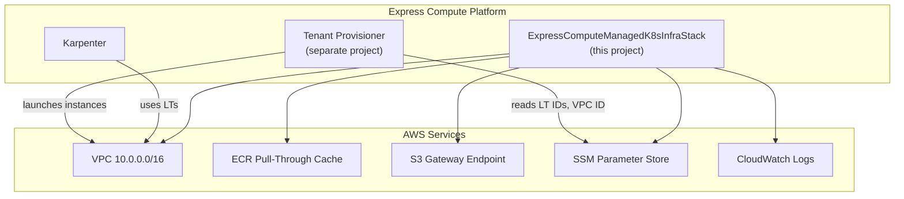
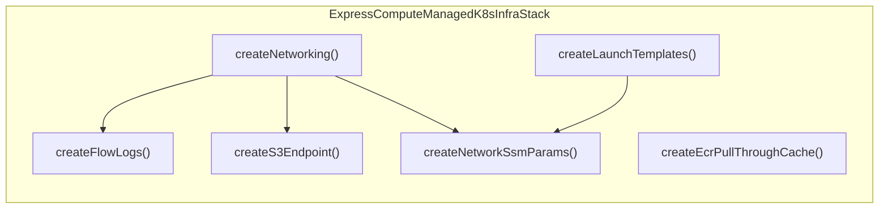
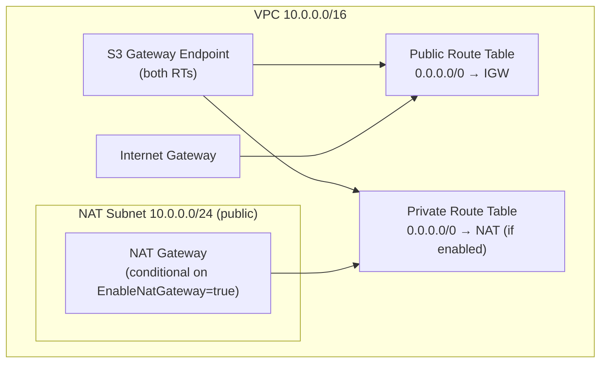
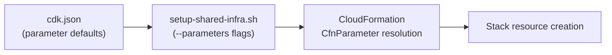

# Architecture

## System Context

## Stack Composition

## Network Architecture

## Configuration Flow

The stack uses **CloudFormation Parameters** (not CDK context) for all runtime-configurable values. `cdk.json` provides defaults via the `parameters` key; the deploy script overrides them with `--parameters` flags.

## Design Patterns

| Pattern | Usage |
|---------|-------|
| L1 Constructs (CfnXxx) | VPC, LTs, ECR cache — fine-grained control needed |
| L2 Constructs | LogGroup, Role — higher-level abstractions sufficient |
| CfnParameter + CfnCondition | NAT Gateway conditionally created based on runtime parameter |
| SSM Parameter Discovery | Outputs published to SSM for decoupled consumer access |
| Record Types | `Networking`, `LtConfig` — lightweight internal data carriers |
| Region-agnostic Synth | Region omitted from CDK Environment; template deployable to any region |
