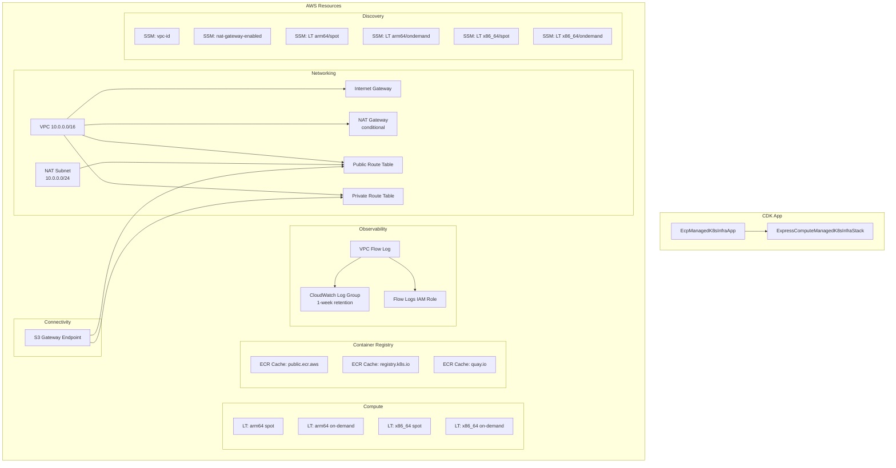
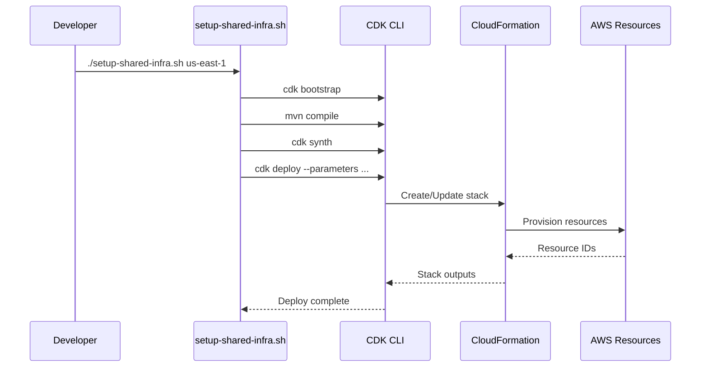
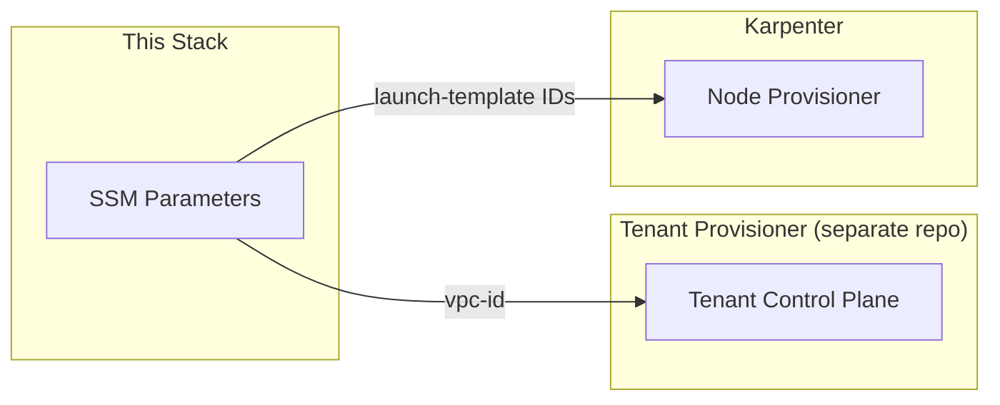

# Architecture

## Overview

The system is a single AWS CDK stack that provisions shared infrastructure for the Express Compute platform. It follows a "shared-nothing per tenant" philosophy where this stack creates the common network and compute primitives, and separate tenant provisioning systems consume outputs via SSM Parameter Store.

## Architecture Diagram

## Design Principles

1. **L1-only constructs** — All resources use `Cfn*` classes for full CloudFormation control. No L2/L3 abstractions are used, ensuring the synthesized template is predictable and auditable.

2. **Region-agnostic synthesis** — The CDK app omits region from the Environment, and passes region as a CloudFormation parameter. This allows one synthesized `cdk.out` to be deployed to any region.

3. **Conditional resources** — The NAT gateway and its associated EIP/route are guarded by a `CfnCondition`, so they are only created when explicitly enabled.

4. **SSM as service discovery** — All consumer-facing resource IDs are published to SSM Parameter Store under a well-known path prefix (`/express-compute/infra/`), decoupling this stack from consumers.

5. **Security defaults** — IMDSv2 required, EBS encryption enabled, no AMI baked in (Karpenter provides AMIs at runtime).

## Deployment Model

## Consumer Interaction

