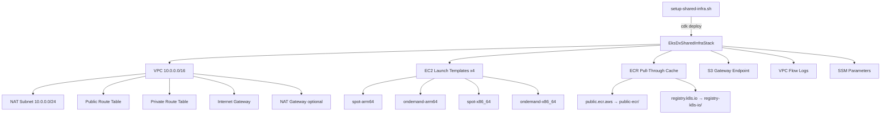

# Architecture

## Overview

The repo manages **shared AWS infrastructure** for EKS-DX. All resources are deployed via a single CDK stack. Tenant control plane provisioning (EC2, IAM, SQS) and cluster bootstrap scripts now live in a separate project.

## Design Decisions

**NAT Gateway off by default** (`enableNatGateway: false` in `cdk.json`). The S3 gateway endpoint covers the main egress cost driver (ECR image pulls, Karpenter pricing data). NAT can be enabled via context override when outbound internet is needed.

**Launch templates without AMI ID** — `imageId` is intentionally absent. The consuming Lambda/provisioner passes the AMI as a `RunInstances` override. This decouples AMI updates from shared infra changes.

**Spot uses hibernation** — spot LTs set `instanceInterruptionBehavior: hibernate` + `hibernationOptions.configured: true`, requiring EBS root volume encryption (enforced via `encrypted: true`).

**IMDS v2 enforced** — all LTs set `httpTokens: required` and `httpPutResponseHopLimit: 2` (hop limit 2 is needed for containers to reach IMDS).

## CDK Context Defaults (`infra/cdk.json`)

| Key | Default | Notes |
|-----|---------|-------|
| `projectName` | `eks-dx-infra` | Prefix for all resource names |
| `instanceTypeArm64` | `m7g.large` | Used in arm64 launch templates |
| `instanceTypeX86_64` | `m7i.large` | Used in x86_64 launch templates |
| `diskSizeGb` | `20` | Root EBS volume size |
| `enableNatGateway` | `false` | Set to `true` to add NAT GW + EIP |
