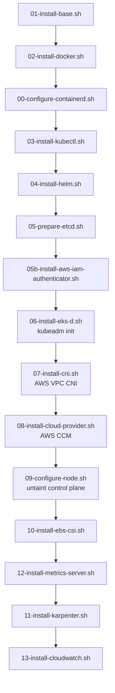

# Components

## Root Lifecycle Scripts

### `bootstrap.sh`
One-time account setup. Creates the S3 Terraform state bucket (`eks-dx-tfstate-<account-id>`) with versioning and encryption, then deploys the shared VPC if it doesn't exist.
- Args: `[region] [project-name]`
- Must run once before any `deploy.sh` calls.

### `build.sh`
Builds a custom AMI with all EKS-D binaries, Helm charts, and container images pre-pulled. Stores the AMI ID in SSM Parameter Store at `/eks-dx/ami/<arch>`. Takes ~20-30 minutes.
- Prompts for: region, architecture (x86_64 / arm64)
- Creates a temporary EC2 key pair, runs Terraform in `ami-builder/`, then destroys the builder instance.
- Env vars: `AWS_REGION`, `ARCH`, `TFSTATE_BUCKET`

### `deploy.sh`
Deploys a developer workstation EC2 instance via Terraform. Writes `terraform/terraform.tfvars`, initialises the S3 backend, and runs `terraform apply`.
- Prompts for: developer IAM username, region, architecture, disk size
- Auto-detects caller's public IP for SSH CIDR if `SSH_CIDR` not set.
- Env vars: `DEVELOPER_USERNAME`, `AWS_REGION`, `ARCH`, `DISK_SIZE_GB`, `SSH_CIDR`, `TFSTATE_BUCKET`

### `destroy.sh`
Destroys a developer workstation. Requires typing `yes` to confirm.
- Env vars: `DEVELOPER_USERNAME`, `AWS_REGION`, `TFSTATE_BUCKET`

### `deploy-vpc.sh`
Deploys the shared VPC. Tags AL2023 AMIs for the specified EKS version via `tag-vpc-amis.sh`, then runs Terraform in `terraform/vpc/`.
- Args: `[region] [eks-version] [eksd-version] [project-name]`

### `tag-vpc-amis.sh`
Tags AL2023 EKS-Optimized AMIs in the account with EKS version metadata so Karpenter can discover them.

---

## Terraform Modules

### `terraform/` — Workstation
Provisions per-developer resources:
- Public + private subnets (auto-indexed CIDR within shared VPC)
- IAM role + instance profile (`eks-dx-workstation-<username>`)
- Security group (SSH from caller IP, :6443 and :10250 from VPC, self-referencing for pod networking)
- SQS queue (Karpenter interruption handling)
- EC2 instance (AMI from SSM, user data runs `workstation-boot.sh`)
- Two EBS volumes: root (configurable, default 50GB gp3) + etcd (`/dev/sdf`, 20GB gp3)

### `terraform/vpc/` — Shared VPC
Provisions shared networking:
- VPC with public/private route tables
- Internet Gateway + NAT Gateway
- Tagged with `EKSVersion` and `EKSDVersion` for AMI builder discovery

### `ami-builder/` — AMI Builder
Terraform + scripts to build the custom AMI:
- Spins up a builder EC2 instance
- Runs `ami-builder/scripts/install.sh` via SSH
- Creates AMI from the instance, stores ID in SSM

---

## EKS-D Setup Scripts (`eks-d-setup/`)

Two entry points depending on path:

| Entry Point | When Used |
|-------------|-----------|
| `workstation-boot.sh` | AMI path — runs at EC2 first boot via user data; idempotent (marker: `/opt/eks-d/.installation_complete`) |
| `install-all.sh` | Fresh install path — run manually after SSH |

### Script Execution Order

### Key Scripts

**`05b-install-aws-iam-authenticator.sh`** — Creates three files required by the API server webhook before `kubeadm init`:
1. `/etc/kubernetes/aws-iam-authenticator/config.yaml` — maps IAM role to `system:node:*`
2. `/etc/kubernetes/aws-iam-authenticator/kubeconfig.yaml` — webhook kubeconfig for API server
3. `/etc/kubernetes/manifests/aws-iam-authenticator.yaml` — static pod manifest

**`06-install-eks-d.sh`** — Downloads EKS-D binaries from the release manifest, creates kubelet systemd service, installs ECR credential provider, runs `kubeadm init` with EKS-D image repositories. In AMI build mode (`AMI_BUILD=true`), skips `kubeadm init`.

**`07-install-cni.sh`** — Disables `ec2-net-utils` policy-routes (conflicts with VPC CNI pod routing on AL2023), then installs AWS VPC CNI v1.20.4. Sets `AWS_VPC_K8S_CNI_EXTERNALSNAT=false`.

**`11-install-karpenter.sh`** — Installs Karpenter via Helm from OCI registry. Reads cluster identity from `/opt/eks-d/cluster.env`. Sets `eksControlPlane=false` and explicit `clusterEndpoint`.

---

## Node Pools (`node-pools/`)

### `configure-nodepools.sh`
Runtime discovery + apply script. Queries:
- SSM for EKS-Optimized AL2023 AMI ID (matching cluster's k8s minor version + arch)
- EC2 for subnet ID (tagged `Developer=<signum>`, `SubnetType=Private`)
- EC2 for security group ID (named `eks-dx-workstation-<signum>`)
- Kubernetes API for CA bundle and service CIDR

Renders the Helm chart to `/opt/eks-d/karpenter_runtime_configuration/karpenter-manifests.yaml` and applies it.

### `chart/` — Helm Chart
Generates a single `NodePool` + `EC2NodeClass` pair using `karpenter.sh/v1` and `karpenter.k8s.aws/v1` APIs. Uses `amiFamily: Custom` with explicit `nodeadm` user data.

---

## AMI Builder Scripts (`ami-builder/scripts/`)

### `install.sh`
Runs inside the builder EC2. Pre-pulls:
- EKS-D control plane images (kube-apiserver, etcd, coredns) from release manifest
- Karpenter, AWS CCM, EBS CSI, CloudWatch Observability Helm charts
- All container images extracted from those charts
- AWS VPC CNI manifest
- EKS-D setup scripts → `/opt/eks-d-setup/`

### `discover-eks-d.sh`
Queries the EKS-D release manifest to extract component versions (image tags, binary URLs) and writes them to an env file.
