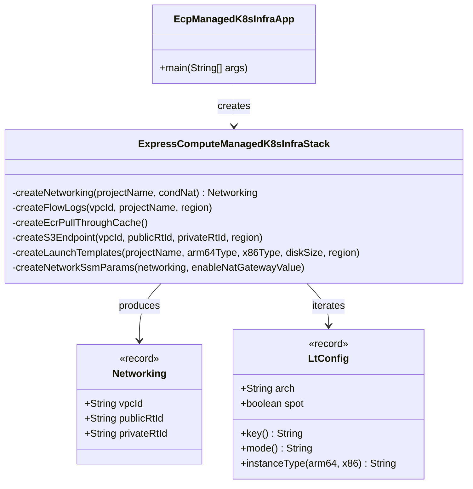

# Components

## Component Map

## 1. VPC Networking (`createNetworking`)

Creates the foundational network layer.

| Resource | Details |
|----------|---------|
| VPC | CIDR `10.0.0.0/16`, DNS hostnames + support enabled |
| Internet Gateway | Attached to VPC |
| NAT Subnet | `10.0.0.0/24`, first AZ, public IP on launch |
| NAT Gateway | Conditional on `EnableNatGateway=true`; uses Elastic IP |
| Public Route Table | Default route → IGW |
| Private Route Table | Default route → NAT (conditional) |

**Conditional behavior:** When NAT is disabled, the private route table has no default route, so resources on it have no internet egress (only S3 via the gateway endpoint).

## 2. VPC Flow Logs (`createFlowLogs`)

| Resource | Details |
|----------|---------|
| CloudWatch Log Group | `/aws/vpc/{region}/{project}-flow-logs`, 1-week retention, DESTROY on stack delete |
| IAM Role | `{project}-vpc-flow-logs-role-{region}`, assumed by `vpc-flow-logs.amazonaws.com` |
| Flow Log | Captures ALL traffic, sends to CloudWatch |

## 3. ECR Pull-Through Cache (`createEcrPullThroughCache`)

Mirrors upstream container registries into account-level ECR to reduce pull latency and avoid rate limits.

| Prefix | Upstream |
|--------|----------|
| `public-ecr` | `public.ecr.aws` |
| `registry-k8s-io` | `registry.k8s.io` |
| `quay-io` | `quay.io` |

## 4. S3 Gateway Endpoint (`createS3Endpoint`)

Gateway endpoint for S3, attached to both public and private route tables. Keeps ECR layer pulls (which use S3 under the hood) and Karpenter pricing data off NAT, reducing cost and improving throughput.

## 5. EC2 Launch Templates (`createLaunchTemplates`)

Generates 4 launch templates from a matrix of `{arm64, x86_64} × {spot, on-demand}`:

| Property | Value |
|----------|-------|
| IMDS | v2 required (hop limit 2) |
| Root EBS (`/dev/xvda`) | gp3, encrypted, delete-on-terminate |
| Data EBS (`/dev/sdf`) | gp3, 20 GiB, encrypted, delete-on-terminate |
| Spot behavior | Persistent + hibernate on interruption |
| Instance tags | Platform=express-compute, Arch, ManagedBy=Karpenter |
| Volume tags | Platform=express-compute, ManagedBy=CDK |
| No AMI ID | Intentional — Karpenter resolves AMI at runtime |

## 6. SSM Parameters (`createNetworkSsmParams`)

Publishes resource IDs for consumer stacks:

| Parameter Path | Value |
|----------------|-------|
| `/express-compute/infra/network/vpc-id` | VPC ID |
| `/express-compute/infra/network/nat-gateway-enabled` | `true` or `false` |
| `/express-compute/infra/launch-template/{arch}/{mode}` | Launch Template ID |
