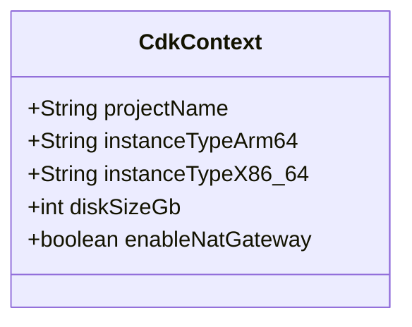

# Data Models

## CDK Context (runtime configuration)

Read at stack construction time from `cdk.json` or `--context` overrides.



## Internal Records

### `Networking`

Carries CloudFormation token references between `createNetworking()` and downstream methods.

```java
record Networking(String vpcId, String publicRtId, String privateRtId)
```

### `LtConfig`

Encodes the two-axis variation for launch templates.

```java
record LtConfig(String arch, boolean spot)
// arch ∈ {"arm64", "x86_64"}
// key()  → "{spot|ondemand}-{arch}"
// mode() → "spot" | "ondemand"
// instanceType(arm64Type, x86Type) → selects by arch
```

## EBS Volume Layout (per launch template)

| Device | Type | Size | Encrypted | Purpose |
|--------|------|------|-----------|---------|
| `/dev/xvda` | gp3 | `diskSizeGb` (configurable) | true | Root OS volume |
| `/dev/sdf` | gp3 | 20 GiB (fixed) | true | Secondary data volume |

## SSM Parameter Values

All parameters are `StringParameter` type (not SecureString). Values are CloudFormation token references resolved at deploy time.

## EC2 Instance Tags (applied via launch template `tagSpecifications`)

| Tag key | Value | Resource |
|---------|-------|---------|
| `Platform` | `eks-d-xpress` | instance + volume |
| `Arch` | `arm64` or `x86_64` | instance |
| `ManagedBy` | `Karpenter` | instance |
| `ManagedBy` | `CDK` | volume, launch-template |
| `Mode` | `spot` or `on-demand` | launch-template resource |
