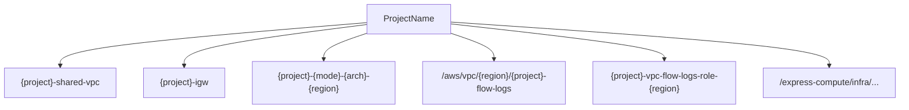

# Data Models

## Internal Records

The stack uses Java records for internal data passing. These are not persisted or serialized.

### `Networking`

```java
private record Networking(String vpcId, String publicRtId, String privateRtId) {}
```

Returned by `createNetworking()` to pass VPC resource references to downstream methods (S3 endpoint, SSM parameters).

### `LtConfig`

```java
private record LtConfig(String arch, boolean spot) {
    String key()  { return (spot ? "spot" : "ondemand") + "-" + arch; }
    String mode() { return spot ? "spot" : "ondemand"; }
    String instanceType(String arm64Type, String x86Type) {
        return arch.equals("arm64") ? arm64Type : x86Type;
    }
}
```

Configuration object for the launch template generation loop. Encapsulates the matrix of `{arch} × {spot/ondemand}` and provides naming helpers.

## Configuration Structure

### `cdk.json` Parameters

```json
{
  "app": "mvn -e -q compile exec:java",
  "parameters": {
    "ExpressComputeManagedK8sInfraStack": {
      "ProjectName": "ecp-managed-k8s-infra",
      "InstanceTypeArm64": "c6g.xlarge",
      "InstanceTypeX86": "m7i.large",
      "DiskSizeGb": "20",
      "EnableNatGateway": "false"
    }
  }
}
```

## Resource Naming Conventions



## Tagging Strategy

All resources are tagged with a consistent scheme:

| Tag Key | Applied To | Values |
|---------|-----------|--------|
| Name | All named resources | Descriptive name |
| Project | VPC, IGW, subnets, route tables, NAT, EIP, flow log | `{projectName}` |
| ManagedBy | Launch templates, volumes | `CDK` or `Karpenter` |
| Platform | Instances, volumes, LTs | `express-compute` |
| Arch | Instances, LTs | `arm64` or `x86_64` |
| Mode | LTs | `spot` or `on-demand` |
| Type | Subnets | `NAT` |
