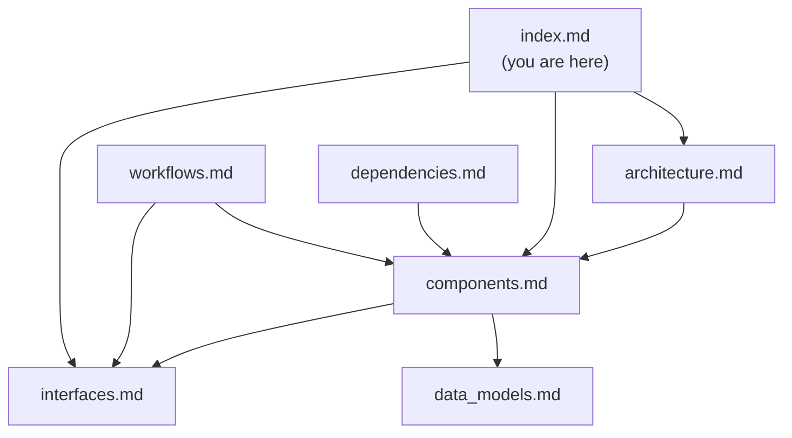

# Documentation Index

> **For AI Assistants**: This file is the primary entry point for understanding this codebase. Read this first to determine which detailed files contain the information you need.

## Quick Reference

- **What is this?** Shared AWS infrastructure (VPC, launch templates, ECR cache) for the EKS-DX platform
- **Language**: Java 21 CDK
- **Stack**: Single CDK stack (`EksDxSharedInfraStack`)
- **Deploy**: `./setup-shared-infra.sh [region] [projectName]`
- **Source**: `infra/src/main/java/cloud/plasticity/eksdx/SharedInfraStack.java`

## Documentation Files

| File | Purpose | Consult When... |
|------|---------|-----------------|
| [codebase_info.md](codebase_info.md) | Technology stack, language breakdown, design decisions | You need project metadata or tech stack details |
| [architecture.md](architecture.md) | System context diagrams, stack composition, network layout, design patterns | You need to understand how components relate or the overall system design |
| [components.md](components.md) | Detailed breakdown of each method/resource group in the stack | You need specifics about what a method creates or configures |
| [interfaces.md](interfaces.md) | SSM parameters, CDK context inputs, ECR cache patterns, CLI args, release artifacts | You need to know inputs/outputs or how consumers integrate |
| [data_models.md](data_models.md) | Internal records, tagging model, EBS volume layout | You need to understand data structures or resource tagging |
| [workflows.md](workflows.md) | Deploy, destroy, release, and consumer integration sequences | You need to understand operational procedures |
| [dependencies.md](dependencies.md) | Build deps, runtime tools, AWS services, pre-commit hooks, CI | You need version info or dependency details |
| [review_notes.md](review_notes.md) | Consistency/completeness review findings | You want to know documentation gaps or issues |

## Relationships Between Files

- **architecture.md** provides the high-level view; drill into **components.md** for implementation details
- **interfaces.md** documents both inputs (CDK context) and outputs (SSM params); cross-reference with **components.md** to see how they're produced
- **workflows.md** references steps documented in **components.md** and outputs documented in **interfaces.md**
- **data_models.md** documents internal types used in **components.md**

## Example Queries

| Question | Start With |
|----------|-----------|
| "What resources does this stack create?" | components.md |
| "How do I change the instance type?" | interfaces.md → CDK Context section |
| "How does the tenant provisioner consume this?" | workflows.md → Consumer Integration |
| "What tags are applied to instances?" | data_models.md → Tagging Model |
| "What's the deploy process?" | workflows.md → Deploy Workflow |
| "What AWS services cost money?" | dependencies.md → AWS Services Used |
| "Why is NAT Gateway optional?" | architecture.md → Design Patterns |
