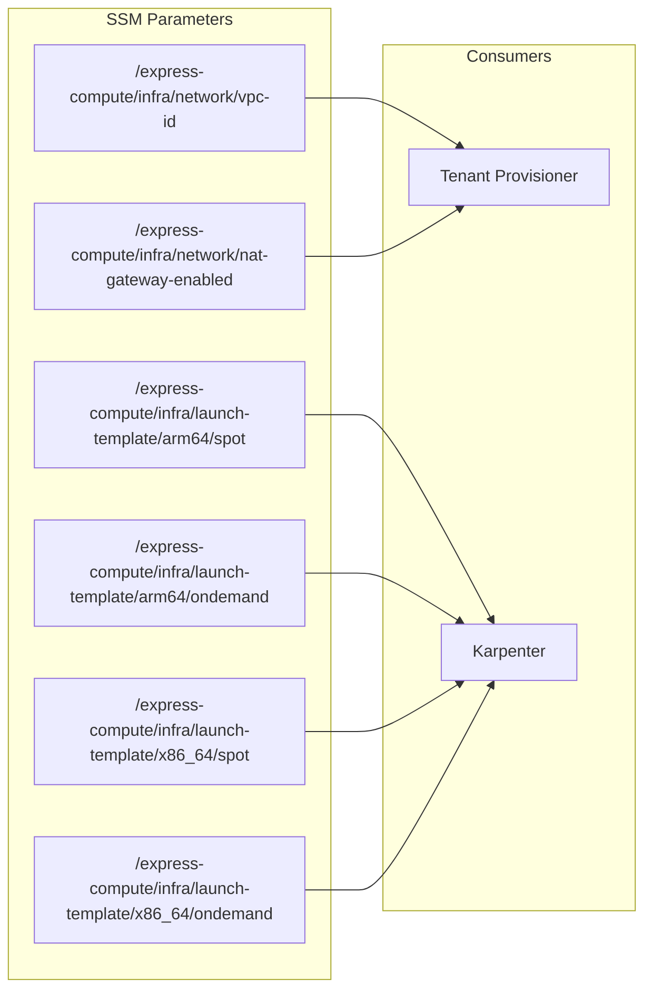

# Interfaces

## Inbound Interfaces (Inputs)

### 1. Shell Script Arguments

**`setup-shared-infra.sh`**

| Position | Name | Default | Description |
|----------|------|---------|-------------|
| $1 | REGION | us-east-1 | AWS deployment region |
| $2 | PROJECT_NAME | ecp-managed-k8s-infra | Resource naming prefix |
| $3 | INSTANCE_TYPE_ARM64 | c6g.xlarge | ARM64 instance type |
| $4 | INSTANCE_TYPE_X86 | m7i.large | x86_64 instance type |
| $5 | DISK_SIZE_GB | 20 | Root EBS volume GiB |
| $6 | ENABLE_NAT_GATEWAY | false | NAT gateway toggle |

**`delete-shared-infra.sh`**

| Position | Name | Default | Description |
|----------|------|---------|-------------|
| $1 | REGION | us-east-1 | Region of stack to destroy |
| $2 | PROJECT_NAME | ecp-managed-k8s-infra | Project name (for stack identification) |

### 2. CDK Context (`infra/cdk.json`)

The `parameters` block in `cdk.json` defines default CloudFormation parameter values used during `cdk synth`/`cdk deploy`.

### 3. CloudFormation Parameters

| Parameter | Type | Allowed Values |
|-----------|------|----------------|
| ProjectName | String | — |
| InstanceTypeArm64 | String | — |
| InstanceTypeX86 | String | — |
| DiskSizeGb | Number | — |
| EnableNatGateway | String | `true`, `false` |
| Region | String | — |

### 4. Environment Variables

| Variable | Used By | Purpose |
|----------|---------|---------|
| CDK_DEFAULT_ACCOUNT | CDK App | AWS account ID for environment binding |
| CDK_DEFAULT_REGION | setup script | Passed to CDK bootstrap |

## Outbound Interfaces (Outputs)

### SSM Parameter Store

All outputs are written to SSM Parameter Store under the `/express-compute/infra/` namespace:

### Integration Contract

Consumers of this stack must:
1. Read SSM parameters at their deploy/runtime to discover infrastructure IDs
2. Create subnets in the shared VPC (this stack only creates the NAT subnet)
3. Provide their own security groups
4. Attach to the appropriate route table (public or private) based on egress needs

### ECR Pull-Through Cache Prefixes

Container image pulls should reference:
- `{account}.dkr.ecr.{region}.amazonaws.com/public-ecr/{image}` (for public.ecr.aws images)
- `{account}.dkr.ecr.{region}.amazonaws.com/registry-k8s-io/{image}` (for registry.k8s.io images)
- `{account}.dkr.ecr.{region}.amazonaws.com/quay-io/{image}` (for quay.io images)
