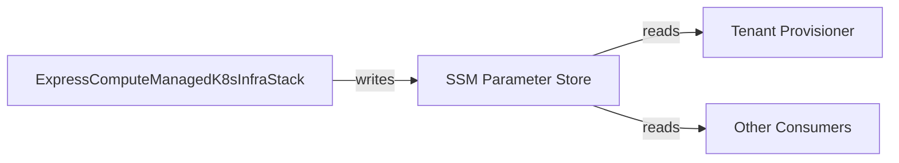

# Interfaces

## CloudFormation Parameters (Input Interface)

Configuration is injected as CloudFormation Parameters at deploy time. Defaults are defined in `cdk.json` under the `parameters.ExpressComputeManagedK8sInfraStack` key.

| Parameter | Type | Default | Description |
|-----------|------|---------|-------------|
| `ProjectName` | String | `ecp-managed-k8s-infra` | Resource naming prefix |
| `InstanceTypeArm64` | String | `c6g.xlarge` | ARM instance type |
| `InstanceTypeX86` | String | `m7i.large` | x86 instance type |
| `DiskSizeGb` | Number | `20` | Root EBS volume size (GiB) |
| `EnableNatGateway` | String | `false` | Create NAT Gateway (`true`/`false`) |
| `Region` | String | (from script) | AWS region — must be passed explicitly |

Override via the deploy script:
```bash
./setup-shared-infra.sh us-west-2 my-project c7g.xlarge m7i.xlarge 50 true
```

Or via CDK CLI directly:
```bash
cdk deploy ExpressComputeManagedK8sInfraStack \
  --parameters ExpressComputeManagedK8sInfraStack:InstanceTypeArm64=c7g.xlarge \
  --parameters ExpressComputeManagedK8sInfraStack:EnableNatGateway=true
```

## SSM Parameter Store (Output Interface)

The stack publishes outputs to SSM Parameter Store for decoupled consumption by other services (tenant provisioner, Karpenter).



### Parameters Published

| Path | Type | Description |
|------|------|-------------|
| `/express-compute/infra/network/vpc-id` | String | VPC ID |
| `/express-compute/infra/network/nat-gateway-enabled` | String | `true` or `false` |
| `/express-compute/infra/launch-template/arm64/spot` | String | LT ID |
| `/express-compute/infra/launch-template/arm64/ondemand` | String | LT ID |
| `/express-compute/infra/launch-template/x86_64/spot` | String | LT ID |
| `/express-compute/infra/launch-template/x86_64/ondemand` | String | LT ID |

## ECR Pull-Through Cache (Registry Interface)

Downstream consumers reference cached images using account ECR prefixes:

| Pull pattern | Resolves to |
|-------------|-------------|
| `{account}.dkr.ecr.{region}.amazonaws.com/public-ecr/{image}` | `public.ecr.aws/{image}` |
| `{account}.dkr.ecr.{region}.amazonaws.com/registry-k8s-io/{image}` | `registry.k8s.io/{image}` |
| `{account}.dkr.ecr.{region}.amazonaws.com/quay-io/{image}` | `quay.io/{image}` |

## Shell Script Interface

```
./setup-shared-infra.sh [region] [projectName] [instanceTypeArm64] [instanceTypeX86] [diskSizeGb] [enableNatGateway]
./delete-shared-infra.sh [region] [projectName]
```

| Arg | Position | Default | Used By |
|-----|----------|---------|---------|
| `region` | 1 | `us-east-1` | Both scripts |
| `projectName` | 2 | `ecp-managed-k8s-infra` | Both scripts |
| `instanceTypeArm64` | 3 | `c6g.xlarge` | setup only |
| `instanceTypeX86` | 4 | `m7i.large` | setup only |
| `diskSizeGb` | 5 | `20` | setup only |
| `enableNatGateway` | 6 | `false` | setup only |

Environment variables set by scripts: `CDK_DEFAULT_REGION`, `CDK_DEFAULT_ACCOUNT`.

## GitHub Release Artifacts

On `v*` tag push, the release workflow produces:

| Artifact | Contents |
|----------|----------|
| `express-compute-managed-k8s-infra-{VERSION}.tar.gz` | README + `infra/` directory |
| `checksums.sha256` | SHA-256 of the tarball |
