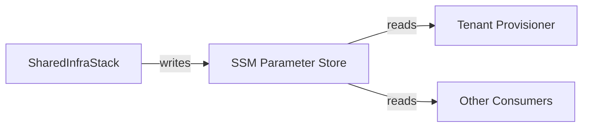

# Interfaces

## SSM Parameter Store (Output Interface)

The stack publishes outputs to SSM Parameter Store for decoupled consumption by other services (tenant provisioner, Karpenter).



### Parameters Published

| Path | Type | Description |
|------|------|-------------|
| `/eks-d-xpress/infra/network/vpc-id` | String | VPC ID |
| `/eks-d-xpress/infra/network/nat-gateway-enabled` | String | `true` or `false` |
| `/eks-d-xpress/infra/launch-template/arm64/spot` | String | LT ID |
| `/eks-d-xpress/infra/launch-template/arm64/ondemand` | String | LT ID |
| `/eks-d-xpress/infra/launch-template/x86_64/spot` | String | LT ID |
| `/eks-d-xpress/infra/launch-template/x86_64/ondemand` | String | LT ID |

## CDK Context (Input Interface)

Configuration is injected via CDK context values (from `cdk.json` or `--context` flags).

| Key | Type | Default | Description |
|-----|------|---------|-------------|
| `projectName` | String | `eks-dx-infra` | Resource naming prefix |
| `instanceTypeArm64` | String | `c6g.xlarge` | ARM instance type |
| `instanceTypeX86_64` | String | `m7i.large` | x86 instance type |
| `diskSizeGb` | int | `20` | Root EBS volume size (GiB) |
| `enableNatGateway` | boolean | `false` | Create NAT Gateway |

## ECR Pull-Through Cache (Registry Interface)

Downstream consumers reference cached images using account ECR prefixes:

| Pull pattern | Resolves to |
|-------------|-------------|
| `{account}.dkr.ecr.{region}.amazonaws.com/public-ecr/{image}` | `public.ecr.aws/{image}` |
| `{account}.dkr.ecr.{region}.amazonaws.com/registry-k8s-io/{image}` | `registry.k8s.io/{image}` |
| `{account}.dkr.ecr.{region}.amazonaws.com/quay-io/{image}` | `quay.io/{image}` |

## Shell Script Interface

```
./setup-shared-infra.sh [region] [projectName]
./delete-shared-infra.sh [region] [projectName]
```

| Arg | Position | Default |
|-----|----------|---------|
| `region` | 1 | `us-east-1` |
| `projectName` | 2 | `eks-dx-infra` |

Environment variables set by scripts: `CDK_DEFAULT_REGION`, `CDK_DEFAULT_ACCOUNT`.

## GitHub Release Artifacts

On `v*` tag push, the release workflow produces:

| Artifact | Contents |
|----------|----------|
| `eks-d-xpress-infra-{VERSION}.tar.gz` | README, scripts, full `infra/` directory (incl. `cdk.out`) |
| `checksums.sha256` | SHA-256 of the tarball |
