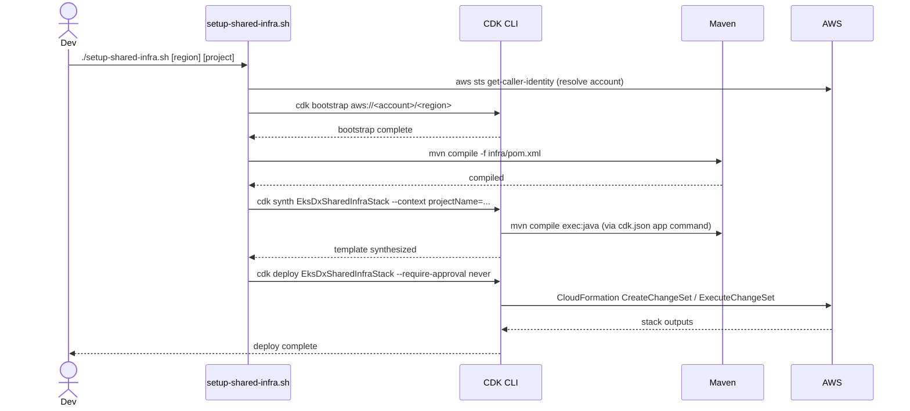
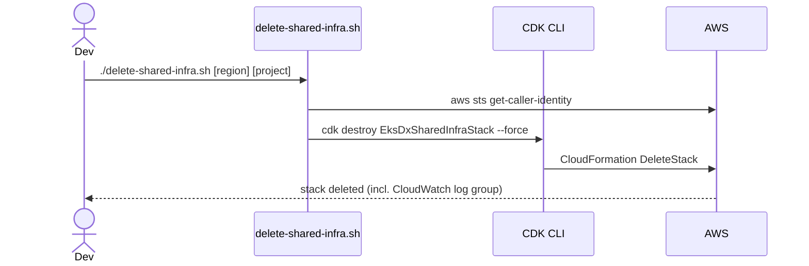
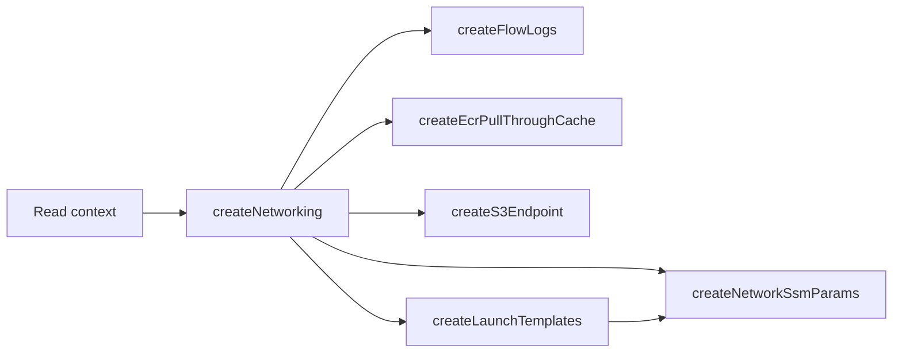
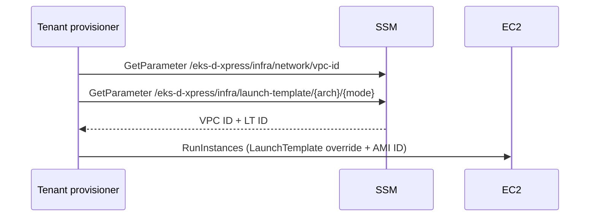

# Workflows

## Deploy

Note: `mvn compile` runs twice — once explicitly in the script for early error visibility, and again implicitly when CDK invokes the app command from `cdk.json`.

## Destroy

## Stack Construction Sequence

## Consumer Read Flow (tenant provisioner)

