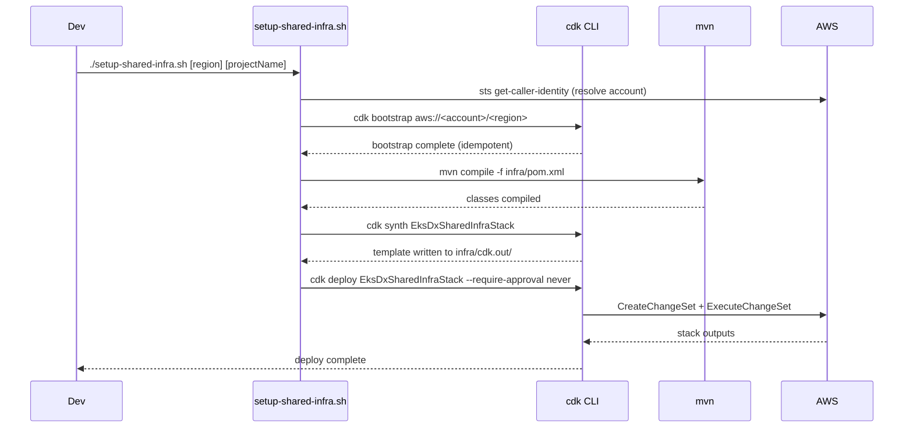
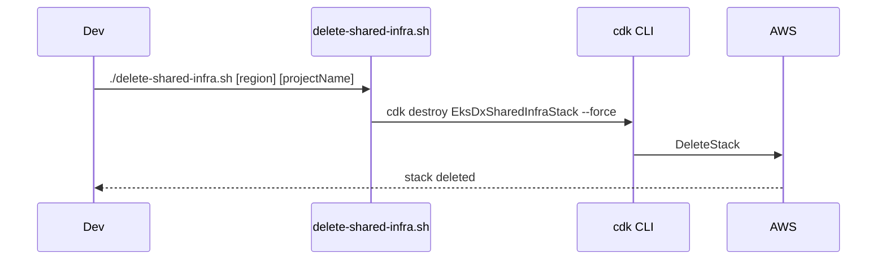
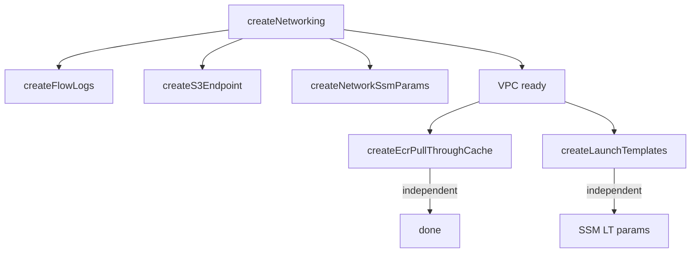

# Workflows

## Deploy Shared Infrastructure



## Destroy Shared Infrastructure



## CDK Synth / Resource Creation Order



Resources with no VPC dependency (`createEcrPullThroughCache`, `createLaunchTemplates`) are synthesized independently. CDK handles CloudFormation dependency ordering automatically.

## Updating Context Values

To change instance types or disk size without modifying `cdk.json`:
```bash
./setup-shared-infra.sh us-east-1 eks-dx-infra \
  # CDK --context flags can be appended by editing setup-shared-infra.sh
  # or by modifying infra/cdk.json defaults
```

To enable NAT Gateway:
```bash
# Edit infra/cdk.json: "enableNatGateway": true
# Then re-run setup-shared-infra.sh
```
