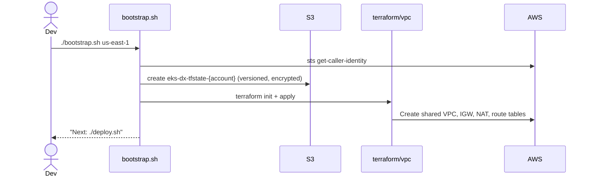
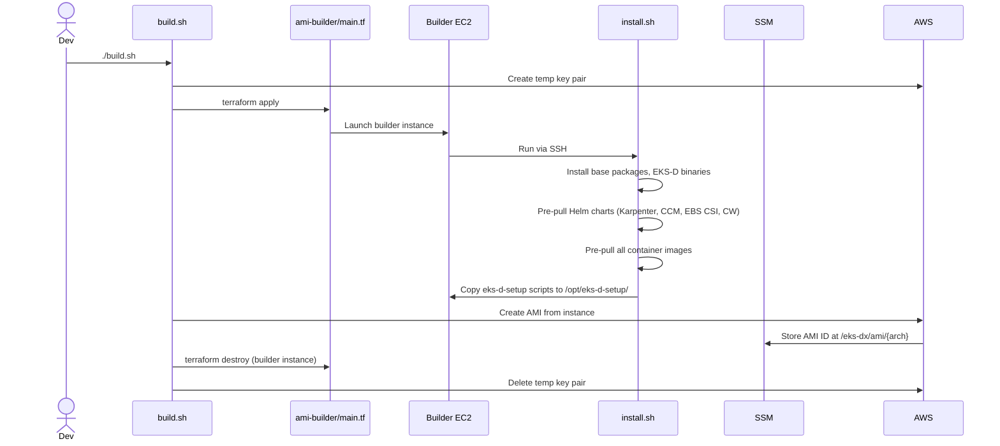
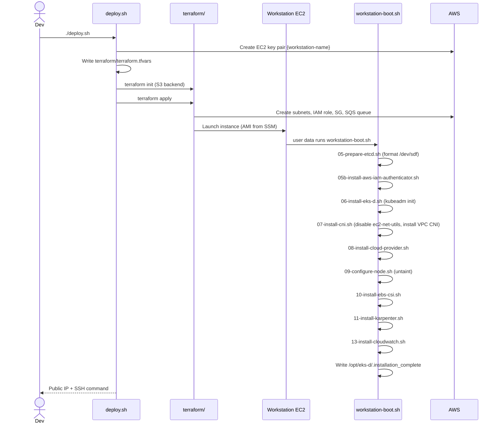
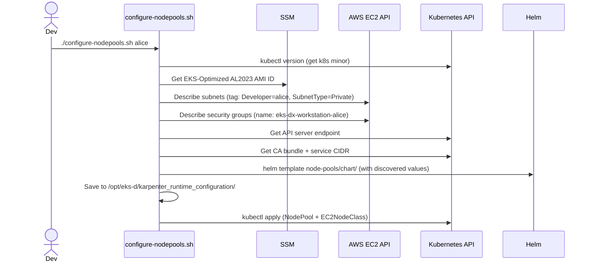
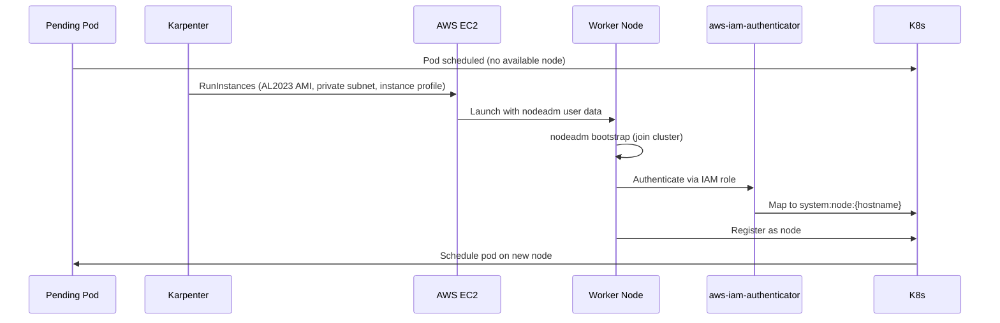

# Workflows

## 1. First-Time Account Setup



## 2. Build Custom AMI



## 3. Deploy Developer Workstation



## 4. Configure Karpenter NodePool



## 5. Worker Node Provisioning (Karpenter)



## 6. Destroy Workstation

```mermaid
sequenceDiagram
    actor Dev
    participant destroy.sh
    participant TF as terraform/

    Dev->>destroy.sh: ./destroy.sh
    destroy.sh->>Dev: Prompt for username, region, arch
    destroy.sh->>Dev: "Type 'yes' to confirm"
    Dev->>destroy.sh: yes
    destroy.sh->>TF: terraform init (S3 backend)
    destroy.sh->>TF: terraform destroy
    TF->>AWS: Delete EC2, subnets, IAM role, SG, SQS queue
```

## Idempotency

- `workstation-boot.sh` checks for `/opt/eks-d/.installation_complete` and exits early if present — safe to reboot without re-running installation.
- `bootstrap.sh` checks for existing S3 bucket and VPC before creating them.
- `configure-nodepools.sh` saves rendered manifests to disk; re-apply without re-discovery: `kubectl apply -f /opt/eks-d/karpenter_runtime_configuration/karpenter-manifests.yaml`
