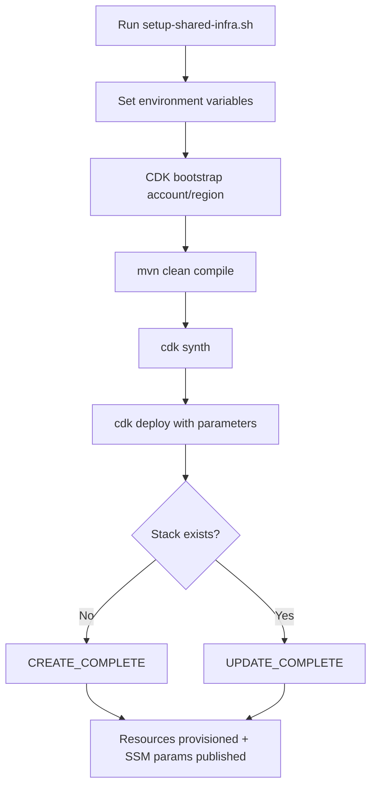
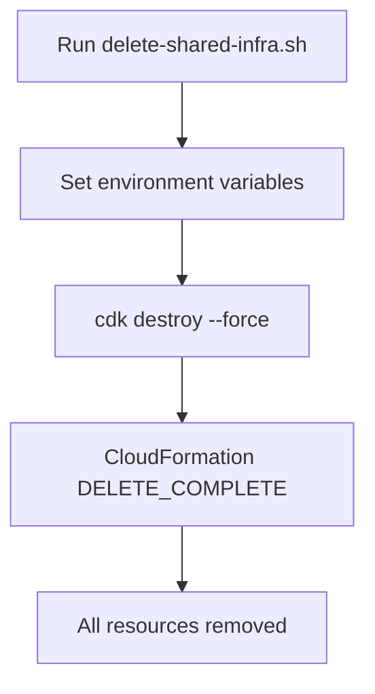
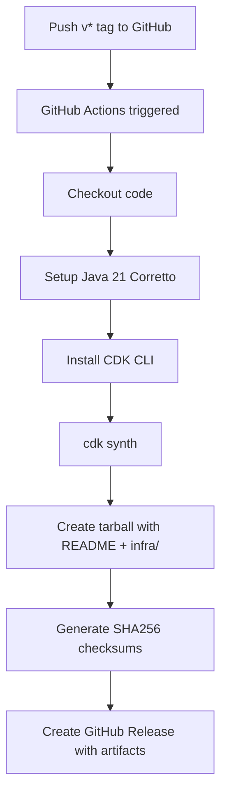
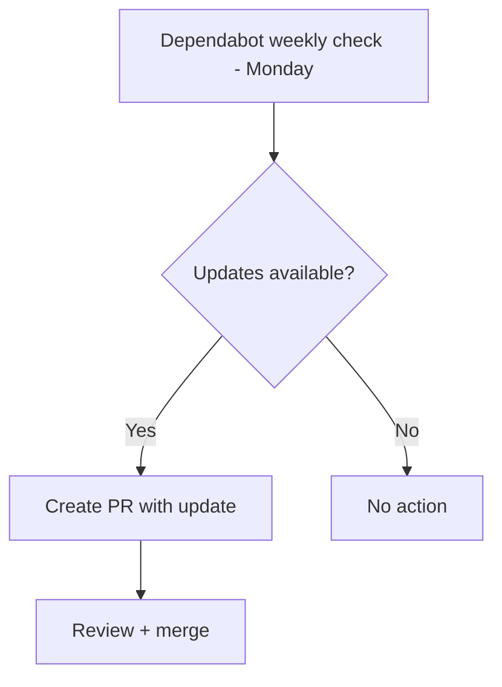

# Workflows

## 1. Deploy Shared Infrastructure

**Prerequisites:**
- AWS CLI configured with valid credentials
- CDK CLI installed (`npm i -g aws-cdk`)
- Java 21 + Maven 3
- Account must be CDK-bootstrapped for target region (script handles this)

**Idempotency:** Re-running `setup-shared-infra.sh` performs a stack update. Only changed resources are modified.

## 2. Destroy Shared Infrastructure

**Caution:** This removes the VPC and all dependent resources. Tenant workloads using this VPC must be torn down first.

## 3. Release Workflow (CI/CD)

**Trigger:** Pushing a tag matching `v*` (e.g., `v1.2.0`)
**Artifacts:** `express-compute-managed-k8s-infra-{version}.tar.gz` + `checksums.sha256`
**Release notes:** Auto-generated from commit history

## 4. Dependency Update Workflow

**Ecosystems monitored:**
- Maven (`/infra`) — CDK lib, constructs, exec-maven-plugin
- GitHub Actions (`/`) — action versions

**Limits:** Max 5 open PRs per ecosystem

## 5. Adding a New Resource

When extending this stack with a new resource:

1. Add a private method to `ExpressComputeManagedK8sInfraStack.java` following the existing pattern
2. Call the new method from the constructor, after any resources it depends on
3. If the resource ID needs to be consumed externally, publish it as an SSM parameter
4. Add appropriate tags using the `tag()` helper
5. Update `cdk.json` if new parameters are needed
6. Update `setup-shared-infra.sh` to pass new parameters
7. Run `cdk synth` and verify the template diff
8. Test deploy to a non-production region

## 6. Changing Instance Types or Disk Size

1. Option A: Edit `infra/cdk.json` `parameters` block
2. Option B: Pass as script arguments: `./setup-shared-infra.sh us-east-1 ecp-managed-k8s-infra m7g.xlarge m7i.xlarge 40`
3. Run deploy — CloudFormation updates launch templates in-place (existing instances are unaffected until replacement)
