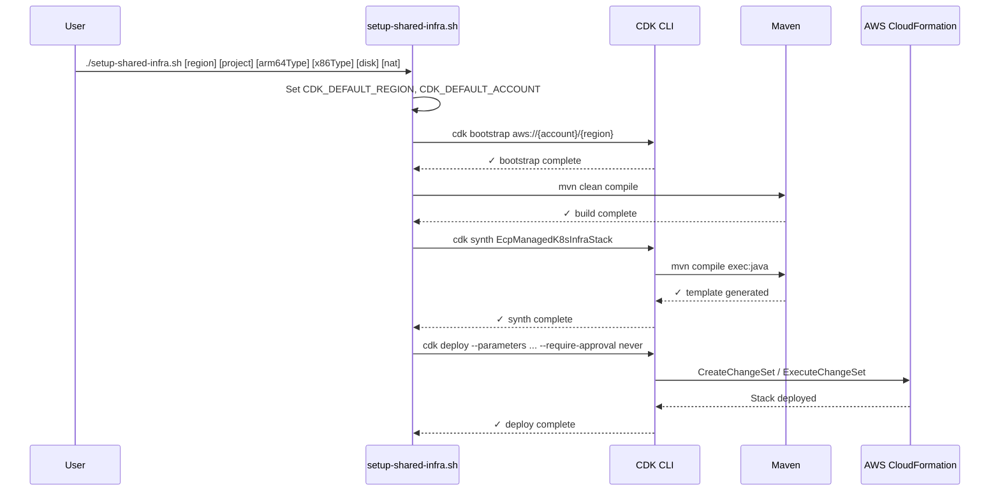
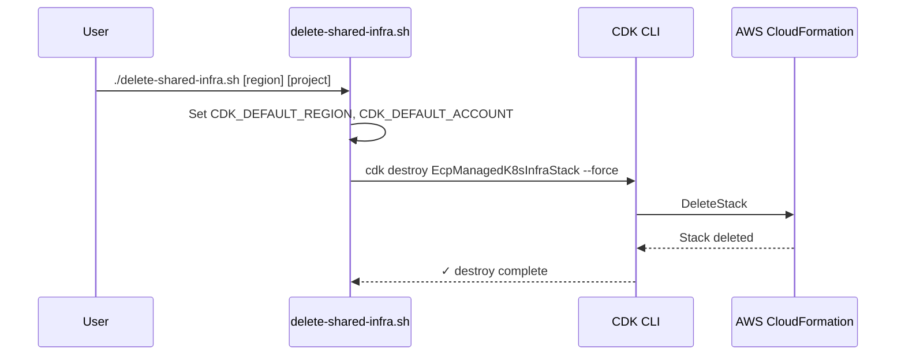
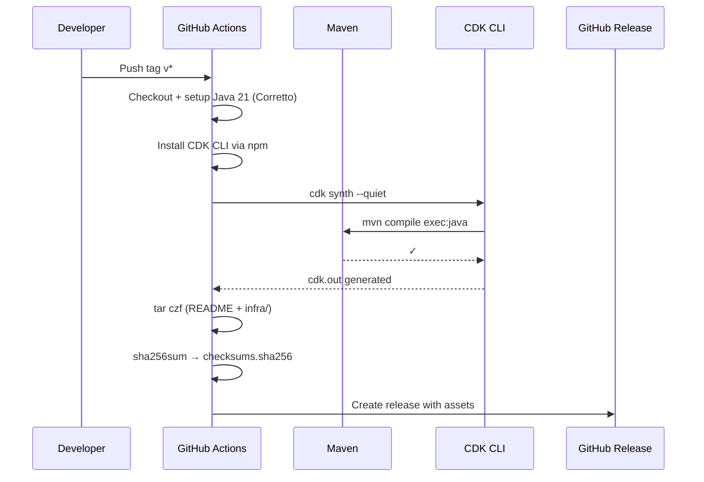
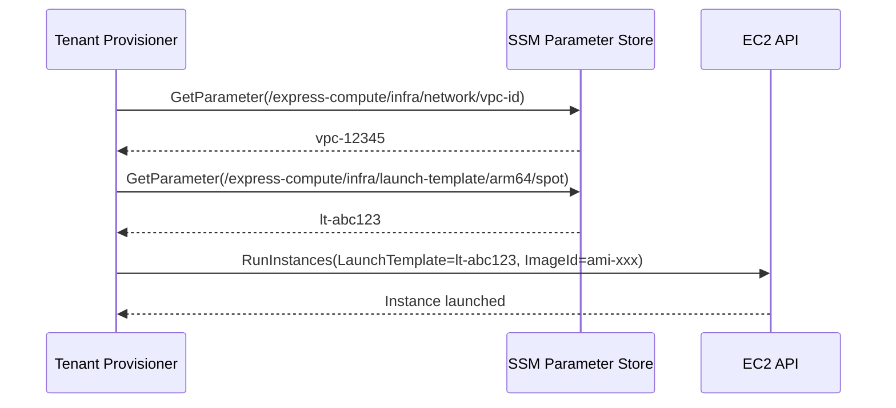
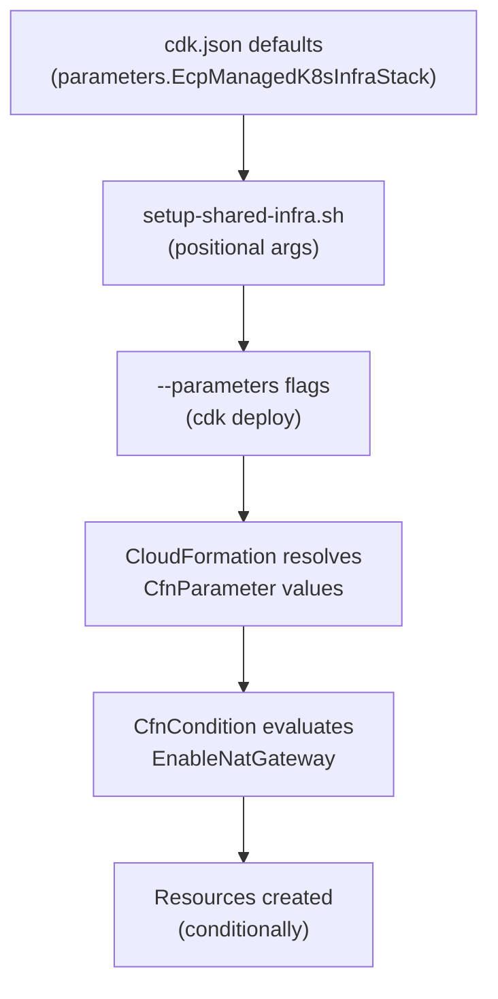

# Workflows

## Deploy Workflow

```mermaid
sequenceDiagram
    participant User
    participant Script as setup-shared-infra.sh
    participant CDK as CDK CLI
    participant Maven
    participant AWS as AWS CloudFormation

    User->>Script: ./setup-shared-infra.sh [region] [project] [arm64Type] [x86Type] [disk] [nat]
    Script->>Script: Set CDK_DEFAULT_REGION, CDK_DEFAULT_ACCOUNT
    Script->>CDK: cdk bootstrap aws://{account}/{region}
    CDK-->>Script: ✓ bootstrap complete
    Script->>Maven: mvn clean compile
    Maven-->>Script: ✓ build complete
    Script->>CDK: cdk synth EcpManagedK8sInfraStack
    CDK->>Maven: mvn compile exec:java
    Maven-->>CDK: ✓ template generated
    CDK-->>Script: ✓ synth complete
    Script->>CDK: cdk deploy --parameters ... --require-approval never
    CDK->>AWS: CreateChangeSet / ExecuteChangeSet
    AWS-->>CDK: Stack deployed
    CDK-->>Script: ✓ deploy complete
```

## Destroy Workflow

```mermaid
sequenceDiagram
    participant User
    participant Script as delete-shared-infra.sh
    participant CDK as CDK CLI
    participant AWS as AWS CloudFormation

    User->>Script: ./delete-shared-infra.sh [region] [project]
    Script->>Script: Set CDK_DEFAULT_REGION, CDK_DEFAULT_ACCOUNT
    Script->>CDK: cdk destroy EcpManagedK8sInfraStack --force
    CDK->>AWS: DeleteStack
    AWS-->>CDK: Stack deleted
    CDK-->>Script: ✓ destroy complete
```

## Release Workflow

```mermaid
sequenceDiagram
    participant Dev as Developer
    participant GH as GitHub Actions
    participant Maven
    participant CDK as CDK CLI
    participant Release as GitHub Release

    Dev->>GH: Push tag v*
    GH->>GH: Checkout + setup Java 21 (Corretto)
    GH->>GH: Install CDK CLI via npm
    GH->>CDK: cdk synth --quiet
    CDK->>Maven: mvn compile exec:java
    Maven-->>CDK: ✓
    CDK-->>GH: cdk.out generated
    GH->>GH: tar czf (README + infra/)
    GH->>GH: sha256sum → checksums.sha256
    GH->>Release: Create release with assets
```

## Consumer Integration Pattern

```mermaid
sequenceDiagram
    participant Tenant as Tenant Provisioner
    participant SSM as SSM Parameter Store
    participant EC2 as EC2 API

    Tenant->>SSM: GetParameter(/express-compute/infra/network/vpc-id)
    SSM-->>Tenant: vpc-12345
    Tenant->>SSM: GetParameter(/express-compute/infra/launch-template/arm64/spot)
    SSM-->>Tenant: lt-abc123
    Tenant->>EC2: RunInstances(LaunchTemplate=lt-abc123, ImageId=ami-xxx)
    EC2-->>Tenant: Instance launched
```

## Parameter Resolution Flow

```mermaid
graph TD
    DEFAULTS["cdk.json defaults<br/>(parameters.EcpManagedK8sInfraStack)"]
    SCRIPT["setup-shared-infra.sh<br/>(positional args)"]
    PARAMS["--parameters flags<br/>(cdk deploy)"]
    CFN["CloudFormation resolves<br/>CfnParameter values"]
    COND["CfnCondition evaluates<br/>EnableNatGateway"]
    RESOURCES["Resources created<br/>(conditionally)"]

    DEFAULTS --> SCRIPT
    SCRIPT --> PARAMS
    PARAMS --> CFN
    CFN --> COND
    COND --> RESOURCES
```
