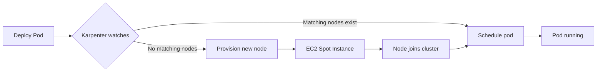

# Workflows

## Deployment Workflow

### 1. VPC Setup
```bash
cd infrastructure
./deploy-vpc.sh us-east-1
```
- Creates shared networking infrastructure
- One-time setup per AWS account/region

### 2. Developer Stack Deployment
```bash
# Automated (user data runs install)
./deploy-developer.sh alice 1 my-key-pair true

# Manual (SSH and run scripts)
./deploy-developer.sh alice 1 my-key-pair false
```

### 3. EKS-D Installation (on EC2)
```bash
# After SSH to instance
cd ~/ecp-single-node-eks-d/eks-d-setup
./install-all.sh
```

### 4. Karpenter Setup
```bash
# On control plane
export CLUSTER_NAME=<cluster-name>
export AWS_REGION=us-east-1

# Install Karpenter
cd ../karpenter-config
./install-karpenter.sh

# Configure NodePools
cd ../node-pools
./configure-nodepools.sh alice us-east-1
```

### 5. Test Workload
```bash
kubectl apply -f test-workload.yaml
```

## Scaling Workflow



## Cleanup Workflow

```bash
# Delete workloads
kubectl delete -f test-workload.yaml

# Wait for node termination
kubectl get nodes -w

# Delete NodePools
kubectl delete nodepool --all

# Destroy CloudFormation stack
aws cloudformation delete-stack --stack-name eks-d-alice

# Delete VPC (if no longer needed)
aws cloudformation delete-stack --stack-name eks-d-shared-vpc
```
