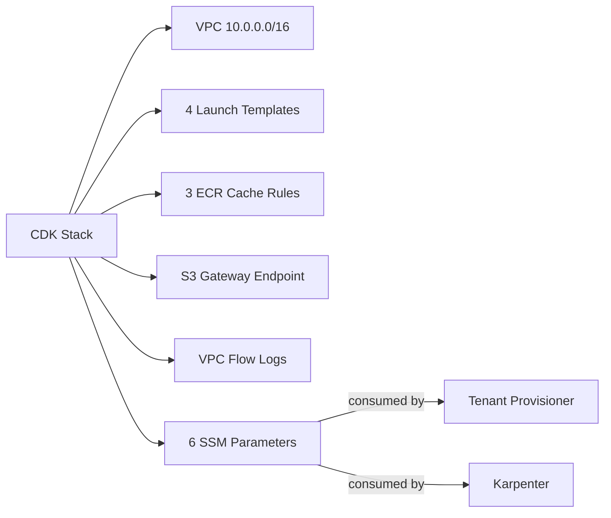

# AGENTS.md
<!-- tags: navigation, architecture, infrastructure, cdk, aws -->

## Project Purpose

Single AWS CDK stack (Java 21) provisioning shared infrastructure for the Express Compute platform. Tenant control-plane provisioning lives in a separate repository and consumes outputs via SSM Parameter Store.

## Directory Map

```
├── setup-shared-infra.sh        # Deploy entrypoint (all params as positional args)
├── delete-shared-infra.sh       # Destroy entrypoint
├── infra/
│   ├── cdk.json                 # CDK app config + default parameter values
│   ├── pom.xml                  # Maven build (Java 21, CDK 2.262.1)
│   └── src/main/java/ai/codriverlabs/ecp/infra/
│       ├── EcpManagedK8sInfraApp.java              # CDK App entry point
│       └── ExpressComputeManagedK8sInfraStack.java  # All infrastructure (single file)
├── .github/
│   ├── workflows/release.yml    # Tag-triggered release (tarball + checksums)
│   └── dependabot.yml           # Weekly Maven + Actions updates
└── .agents/summary/             # Generated documentation (index.md is the entry point)
```

## Key Entry Points

| Task | Start Here |
|------|-----------|
| Understand all resources | `ExpressComputeManagedK8sInfraStack.java` — single file, ~355 lines |
| Deploy | `./setup-shared-infra.sh [region] [project]` |
| Destroy | `./delete-shared-infra.sh [region] [project]` |
| Change defaults | `infra/cdk.json` → `parameters` block |
| Add a resource | New private method in the stack class, call from constructor |

## Architecture at a Glance



## Non-Obvious Patterns

- **L1-only constructs:** All resources use `Cfn*` classes (no L2/L3). This is intentional for template predictability.
- **Region is a CloudFormation parameter**, not a CDK environment property. The synthesized template is region-agnostic and `cdk.out/` can deploy anywhere.
- **No AMI in launch templates:** Karpenter resolves AMIs at runtime. The LTs define everything except the image.
- **Conditional NAT:** Controlled by `CfnCondition`. When disabled, private route table has no default route (S3 still reachable via gateway endpoint).
- **Spot instances use `persistent` + `hibernate`:** Not the default `one-time`/`terminate` behavior.
- **Two EBS volumes per instance:** Root (`/dev/xvda`) + data (`/dev/sdf`), both gp3 encrypted.

## SSM Parameter Namespace

All outputs live under `/express-compute/infra/`:
- `.../network/vpc-id`
- `.../network/nat-gateway-enabled`
- `.../launch-template/{arm64|x86_64}/{spot|ondemand}`

## CI/CD

- **Release:** Push `v*` tag → GitHub Actions builds tarball → GitHub Release
- **Deps:** Dependabot opens PRs weekly (Monday) for Maven + Actions

## Pre-commit Hooks

`trailing-whitespace`, `end-of-file-fixer`, `check-merge-conflict` (pre-commit-hooks v5.0.0)

## Custom Instructions
<!-- This section is for human and agent-maintained operational knowledge.
     Add repo-specific conventions, gotchas, and workflow rules here.
     This section is preserved exactly as-is when re-running codebase-summary. -->
